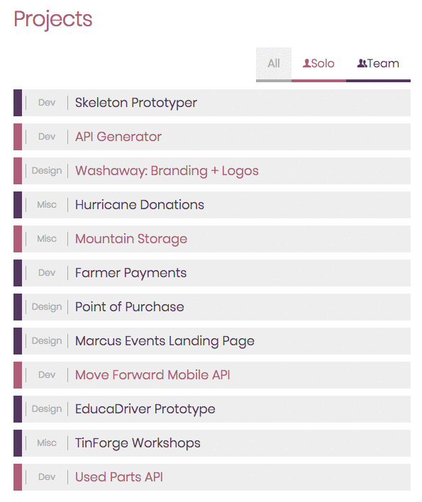

# React Portfolio - Part 3 - State

## Context
María Santiago, a talented designer and full stack developer, has become interested in React and wants to convert her vanilla html/css/js portfolio to React components. She is unfamiliar with the technology, and she has contracted you, a specialized front-end developer, to help her with this project.

You will rebuild her portfolio project from start to finish, starting with basic JSX components and ending with stateful components that implement simple interactivity.

Here is a demo of the sequence of tasks: [Maria Portfolio](https://vanilla-to-react.surge.sh/). In order for your components to render correctly, you will need to have a similar HTML structure with similar class names. You will not need to write CSS for this project because María already has the class names and html structure.

## The Assignment
You will need to modify 2 different components, `Technologies` and `Projects`,  so that they respond to events and update the React component's state. This will require you to study the html and see what dynamic values must be changed

### Setup Instructions
1. Create react app
2. Remove default project files
3. Load project css into `src/index.css` and import into `index.js`
4. Load the components into the `src/` and import into `app.js`

### ShowHideTech Demo

### FilterProjects Demo

